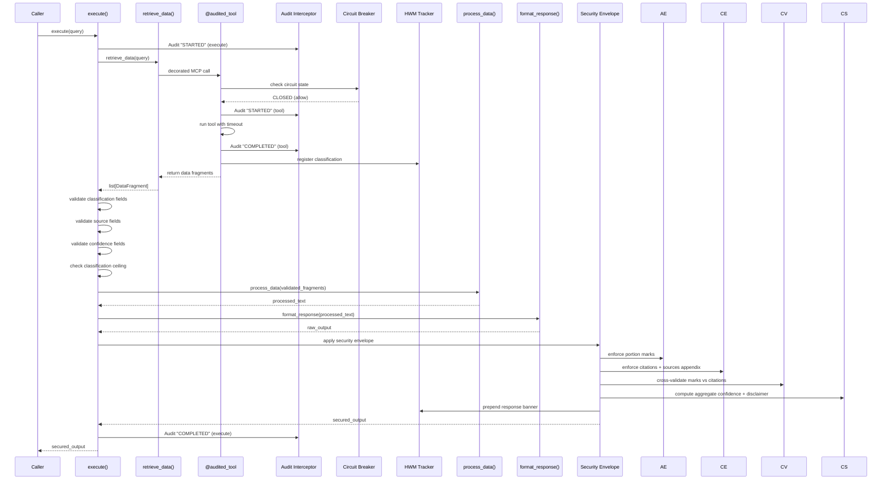
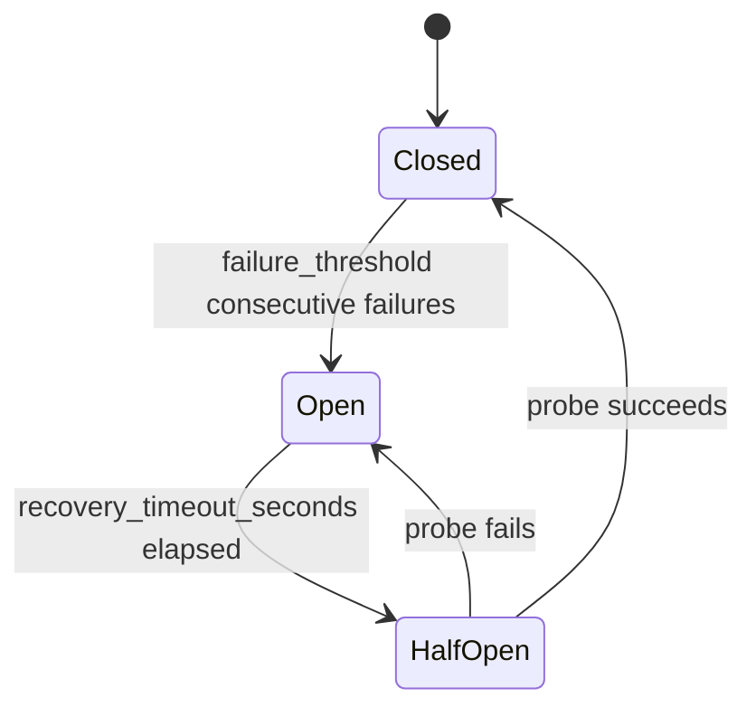

# Design Document: BaseSkill Framework

## Overview

The BaseSkill framework provides a security-by-default Python class hierarchy for building data retrieval Skills in high-security (Intel/Defense) environments. Every Skill inherits mandatory classification marking, audit logging, attribution enforcement, confidence scoring, and access control from the `BaseSkill` abstract base class. Developers extend `BaseSkill` to integrate with external systems (e.g., Confluence, Jira) via MCP tool calls, while the framework guarantees that security governance cannot be bypassed.

The design centers on three pillars:

1. **Contract Enforcement** — An ABC-based `Skill_Contract` forces every concrete Skill to implement `retrieve_data()`, `process_data()`, and `format_response()`. The sealed `execute()` method orchestrates these in a fixed pipeline with security middleware injected automatically.
2. **Decorator-Based Middleware** — The `@audited_tool` decorator wraps MCP tool calls with audit logging, classification tracking, timeout enforcement, and circuit-breaker resilience — all transparent to the Skill developer.
3. **Post-Processing Security Envelope** — After `format_response()` returns, the framework applies attribution enforcement (portion marks), citation verification, cross-validation, confidence disclaimers, and the response banner. This envelope cannot be overridden.

### Key Design Decisions

| Decision | Rationale |
|---|---|
| Python ABC with `@abstractmethod` | Native enforcement — `TypeError` on incomplete implementations without custom metaclass complexity |
| `__init_subclass__` to seal `execute()` | Prevents subclass override at class definition time, not just at call time |
| Decorator pattern for audit/HWM | Composable, explicit opt-in per method, compatible with standard Python decorators |
| Enum with numeric rank for classifications | Enables `max()` comparison and ordering without string parsing at comparison time |
| Hash-chain audit integrity | Provides tamper detection without requiring external PKI infrastructure; "signed" mode available for higher assurance |
| `frozen=True` dataclass for `UserContext` | Immutability enforced by the runtime — no custom `__setattr__` needed |

## Architecture

### High-Level Component Diagram

```mermaid
graph TB
    subgraph "BaseSkill Framework"
        direction TB
        BS[BaseSkill ABC]
        SC[Skill Contract<br/>retrieve_data / process_data / format_response]
        AT[@audited_tool Decorator]
        AI[Audit Interceptor]
        HWM[High-Water Mark Tracker]
        AE[Attribution Enforcer]
        CE[Citation Enforcer]
        CV[Cross-Validator]
        CS[Confidence Scorer]
        CB[Circuit Breaker]
        
        BS --> SC
        BS --> AT
        AT --> AI
        AT --> HWM
        AT --> CB
        BS --> AE
        BS --> CE
        BS --> CV
        BS --> CS
    end

    subgraph "Concrete Skills"
        ECS[ExampleConfluenceSkill]
    end

    subgraph "External"
        MCP[MCP Tool Calls]
        LOG[Audit Sink<br/>logging / hash_chain / signed]
    end

    ECS -->|extends| BS
    ECS -->|@audited_tool| MCP
    AI --> LOG
```

### Execution Flow




## Components and Interfaces

### 1. Classification Model (`classification.py`)

**Validates: Requirements 10, 3**

```python
from enum import IntEnum

class ClassificationLevel(IntEnum):
    U = 0        # UNCLASSIFIED
    C = 1        # CONFIDENTIAL
    S = 2        # SECRET
    TS = 3       # TOP SECRET
    TS_SCI = 4   # TOP SECRET // SCI

    @property
    def display(self) -> str: ...
    
    @property
    def portion_mark(self) -> str: ...

def parse_classification(value: str) -> ClassificationLevel: ...
def compare_classifications(a: ClassificationLevel, b: ClassificationLevel) -> ClassificationLevel: ...
```

- `IntEnum` provides natural ordering via `max()`, satisfying Requirement 3.1's ordered ranking.
- `parse_classification()` accepts strings like `"U"`, `"UNCLASSIFIED"`, `"(U)"`, `"TS//SCI"` and normalizes to the enum member (Req 10.2).
- `compare_classifications()` returns `max(a, b)` leveraging `IntEnum` ordering (Req 10.5).
- Round-trip: `parse_classification(level.display) == level` for all members (Req 10.4).

### 2. Data Models (`models.py`)

**Validates: Requirements 2, 11, 12, 15**

```python
from dataclasses import dataclass, field
from typing import Optional

@dataclass(frozen=True)
class SourceMetadata:
    title: str
    system: str
    url: Optional[str] = None

@dataclass(frozen=True)
class UserContext:
    user_id: str
    auth_method: str  # "CAC", "PKI", "SAML"
    clearance_level: ClassificationLevel

@dataclass
class DataFragment:
    content: str
    classification: ClassificationLevel
    source: SourceMetadata
    confidence: float = 0.5  # default per Req 12.2

@dataclass
class AuditRecord:
    timestamp: str          # ISO-8601
    user_id: str
    auth_method: str
    tool_name: str
    status: str             # STARTED | COMPLETED | FAILED | TIMEOUT | CEILING_VIOLATION | PARTIAL_FAILURE | CB_STATE_CHANGE
    data_classification: Optional[ClassificationLevel] = None
    error_description: Optional[str] = None
    prev_hash: Optional[str] = None
    record_hash: Optional[str] = None
    metadata: dict = field(default_factory=dict)
```

- `UserContext` is `frozen=True` — any attribute mutation raises `FrozenInstanceError` (satisfies Req 15.5 immutability).
- `DataFragment` carries all three mandatory fields: `classification`, `source`, `confidence`.
- `AuditRecord.status` uses a string enum to cover all states from Requirements 4, 13, 17, 19.

### 3. BaseSkill ABC (`base_skill.py`)

**Validates: Requirements 1, 2, 5, 6, 13, 14, 15, 17, 20**

```python
from abc import ABC, abstractmethod

class BaseSkill(ABC):
    def __init__(
        self,
        skill_name: str,
        default_classification: ClassificationLevel,
        user_context: UserContext,
        max_allowed_classification: ClassificationLevel | None = None,
        failure_mode: str = "fail_fast",          # "fail_fast" | "graceful"
        audit_integrity_mode: str = "none",       # "none" | "hash_chain" | "signed"
        confidence_threshold: float = 0.7,
        default_confidence: float = 0.5,
        confidence_penalty: float = 0.2,
        circuit_breaker_config: dict | None = None,
    ): ...

    def __init_subclass__(cls, **kwargs):
        """Seal execute() — raises TypeError if subclass defines it."""
        ...

    # --- Skill Contract (abstract) ---
    @abstractmethod
    def retrieve_data(self, query: str) -> list[DataFragment]: ...

    @abstractmethod
    def process_data(self, data: list[DataFragment]) -> str: ...

    @abstractmethod
    def format_response(self, processed_text: str) -> str: ...

    # --- Sealed orchestration ---
    def execute(self, query: str) -> str:
        """
        Orchestrates: retrieve → validate → process → format → security envelope.
        Cannot be overridden by subclasses.
        """
        ...

    # --- Internal pipeline steps ---
    def _validate_fragments(self, fragments: list[DataFragment]) -> list[DataFragment]: ...
    def _check_classification_ceiling(self, fragment: DataFragment) -> None: ...
    def _apply_security_envelope(self, raw_output: str) -> str: ...
    def _enforce_portion_marks(self, text: str) -> str: ...
    def _enforce_citations(self, text: str, fragments: list[DataFragment]) -> str: ...
    def _cross_validate_marks_and_citations(self, text: str) -> None: ...
    def _compute_confidence(self, fragments: list[DataFragment]) -> float: ...
    def _build_sources_appendix(self, fragments: list[DataFragment]) -> str: ...
    def _build_response_banner(self) -> str: ...
    def _handle_empty_result(self) -> str: ...
```

#### Constructor Logic

1. Validate `user_context` — raise `AuthenticationRequiredError` if missing or incomplete (Req 15.2).
2. Set `max_allowed_classification` — explicit param > `user_context.clearance_level` > `default_classification` with warning (Req 13.4, 15.4).
3. Initialize `_hwm_tracker` (set of `ClassificationLevel`), `_audit_chain` (list), `_retrieval_errors` (list).
4. Initialize circuit breaker state per tool.

#### `execute()` Pipeline

1. Audit "STARTED" for the execute call.
2. Call `retrieve_data(query)`.
3. If empty list → delegate to `_handle_empty_result()` (Req 20).
4. Validate each fragment: classification field (Req 2), source field (Req 11), confidence field (Req 12), ceiling check (Req 13).
5. In `"graceful"` mode, catch per-fragment errors, log `PARTIAL_FAILURE`, continue (Req 17). If all fail → `TotalRetrievalFailureError`.
6. Register valid classifications with HWM tracker.
7. Call `process_data(valid_fragments)`.
8. Call `format_response(processed_text)`.
9. Apply security envelope: portion marks → citations → cross-validation → confidence → banner.
10. Audit "COMPLETED" for the execute call.
11. Return secured output.

#### `__init_subclass__` Seal (Req 14.1)

```python
def __init_subclass__(cls, **kwargs):
    super().__init_subclass__(**kwargs)
    if "execute" in cls.__dict__:
        raise TypeError(
            f"{cls.__name__} cannot override execute(). "
            "The execute() method is sealed to ensure security middleware is always active."
        )
```

### 4. Audited Tool Decorator (`decorators.py`)

**Validates: Requirements 4, 7, 19**

```python
def audited_tool(
    tool_name: str | None = None,
    timeout_seconds: float = 30,
) -> Callable:
    """
    Decorator that wraps a method with:
    1. Circuit breaker check (Req 19.4-5)
    2. Audit "STARTED" record (Req 4.1)
    3. Timeout enforcement via threading (Req 19.1-2)
    4. Audit "COMPLETED" or "FAILED" or "TIMEOUT" record (Req 4.2-3)
    5. HWM registration for returned classification (Req 7.3)
    6. Circuit breaker state update (Req 19.6)
    """
    ...
```

#### Timeout Implementation

Use `concurrent.futures.ThreadPoolExecutor` with `future.result(timeout=timeout_seconds)`. On `TimeoutError`, raise `ToolTimeoutError` and log audit with status `"TIMEOUT"`.

#### Circuit Breaker State Machine



Each tool gets its own circuit breaker instance tracked by `tool_name`. State transitions are logged as audit records with status `"CB_STATE_CHANGE"`.

### 5. Audit Interceptor (`audit.py`)

**Validates: Requirements 4, 16**

```python
class AuditInterceptor:
    def __init__(
        self,
        user_context: UserContext,
        integrity_mode: str = "none",
        sink: Callable[[str], None] | None = None,
        seed: str | None = None,
    ): ...

    def log(self, tool_name: str, status: str, **kwargs) -> AuditRecord: ...
    def _compute_hash(self, record_json: str) -> str: ...
    def _chain_hash(self, record: AuditRecord) -> AuditRecord: ...

    @staticmethod
    def verify_audit_chain(records: list[dict]) -> bool: ...
```

- **"none" mode**: JSON-serialize the `AuditRecord` and emit via `logging.info()`.
- **"hash_chain" mode**: Before emitting, compute `prev_hash` from the last record's JSON, compute `record_hash` from the current record's JSON (with `prev_hash` set, `record_hash` set to empty), then set `record_hash`. First record uses the seed (Req 16.3).
- **"signed" mode**: Extension point — sign the `record_hash` with a configurable key. (Design allows pluggable signing backends.)
- `verify_audit_chain()` recomputes hashes sequentially and checks each `prev_hash` matches (Req 16.4-5).

### 6. High-Water Mark Tracker (`hwm.py`)

**Validates: Requirements 3**

```python
class HighWaterMarkTracker:
    def __init__(self, default: ClassificationLevel): ...
    
    def register(self, level: ClassificationLevel) -> None: ...
    def get_hwm(self) -> ClassificationLevel: ...
    def reset(self) -> None: ...
```

- Internally stores a set of `ClassificationLevel` values.
- `get_hwm()` returns `max(self._levels)` if non-empty, else `self._default` (Req 3.5).
- Idempotence: registering a level ≤ current HWM does not change the HWM (Req 3.6).

### 7. Attribution Enforcer (`attribution.py`)

**Validates: Requirements 5, 18**

```python
class AttributionEnforcer:
    @staticmethod
    def enforce_portion_marks(text: str, hwm: ClassificationLevel) -> str: ...
    
    @staticmethod
    def validate_portion_marks(text: str, hwm: ClassificationLevel) -> None: ...
```

- Splits text on `\n\n` to identify paragraphs (Req 5.3).
- Regex `^\([A-Z/]+\)` detects existing portion marks (Req 5.4).
- Missing marks get the HWM prepended (Req 5.2).
- Marks exceeding HWM raise `ClassificationExceedsHWMError` (Req 5.6).

### 8. Citation Enforcer (`citation.py`)

**Validates: Requirements 11, 18**

```python
class CitationEnforcer:
    @staticmethod
    def format_citation(source: SourceMetadata) -> str: ...
    
    @staticmethod
    def enforce_citations(
        text: str, 
        fragments: list[DataFragment],
    ) -> str: ...
    
    @staticmethod
    def build_sources_appendix(
        fragments: list[DataFragment],
    ) -> str: ...
    
    @staticmethod
    def cross_validate(text: str, fragments: list[DataFragment]) -> None: ...
```

- `format_citation()` produces `[Source: <title>, <system>]` (Req 11.3).
- `enforce_citations()` scans paragraphs for inline citations; appends missing ones (Req 11.4-5).
- `build_sources_appendix()` generates the trailing sources list (Req 11.6).
- `cross_validate()` checks each paragraph's portion mark ≥ max classification of cited sources (Req 18.1-2).

### 9. Confidence Scorer (`confidence.py`)

**Validates: Requirements 12**

```python
class ConfidenceScorer:
    @staticmethod
    def combine_confidence(
        scores: list[float], 
        weights: list[float] | None = None,
    ) -> float: ...
    
    @staticmethod
    def compare_confidence(a: float, b: float) -> float: ...
    
    @staticmethod
    def build_disclaimer(
        aggregate: float,
        fragments: list[DataFragment],
        threshold: float,
    ) -> str | None: ...
```

- `combine_confidence()` computes weighted average; result is bounded by `[min(scores), max(scores)]` (Req 12.8).
- `build_disclaimer()` returns `None` if aggregate ≥ threshold, else a formatted warning string (Req 12.5).

### 10. Circuit Breaker (`circuit_breaker.py`)

**Validates: Requirements 19**

```python
from enum import Enum

class CircuitState(Enum):
    CLOSED = "closed"
    OPEN = "open"
    HALF_OPEN = "half_open"

class CircuitBreaker:
    def __init__(
        self,
        failure_threshold: int = 3,
        recovery_timeout_seconds: float = 60,
    ): ...
    
    def check(self, tool_name: str) -> None: ...
    def record_success(self, tool_name: str) -> None: ...
    def record_failure(self, tool_name: str) -> None: ...
    def get_state(self, tool_name: str) -> CircuitState: ...
```

- Per-tool state tracking with independent failure counters.
- `check()` raises `CircuitBreakerOpenError` if the tool's circuit is open and recovery timeout hasn't elapsed (Req 19.4).
- Half-open state allows exactly one probe call (Req 19.5).

### 11. ExampleConfluenceSkill (`example_confluence_skill.py`)

**Validates: Requirements 8**

```python
class ExampleConfluenceSkill(BaseSkill):
    @audited_tool(tool_name="confluence_search")
    def retrieve_data(self, query: str) -> list[DataFragment]: ...
    
    def process_data(self, data: list[DataFragment]) -> str: ...
    
    def format_response(self, processed_text: str) -> str: ...
```

- `retrieve_data()` calls an imaginary `confluence_search` MCP tool, returns `DataFragment` objects with classification, source, and confidence (Req 8.2-3).
- `process_data()` concatenates fragments preserving portion marks (Req 8.4).
- `format_response()` returns text with portion marks on every paragraph (Req 8.5).

### 12. Steering File (`.kiro/steering/base-skill-security.md`)

**Validates: Requirements 9**

A markdown file containing:
- Instruction to extend `BaseSkill` for every new Skill (Req 9.2).
- Instruction to apply `@audited_tool` to every MCP method (Req 9.3).
- Instruction to include `classification` field in every data retrieval (Req 9.4).
- Instruction to apply portion marks to every paragraph (Req 9.5).
- Security compliance checklist (Req 9.6).


## Data Models

### Classification Level Enum

```python
class ClassificationLevel(IntEnum):
    U = 0        # UNCLASSIFIED — display: "UNCLASSIFIED", portion_mark: "(U)"
    C = 1        # CONFIDENTIAL — display: "CONFIDENTIAL", portion_mark: "(C)"
    S = 2        # SECRET — display: "SECRET", portion_mark: "(S)"
    TS = 3       # TOP SECRET — display: "TOP SECRET", portion_mark: "(TS)"
    TS_SCI = 4   # TOP SECRET//SCI — display: "TOP SECRET//SCI", portion_mark: "(TS//SCI)"
```

The `IntEnum` base provides:
- Natural ordering: `ClassificationLevel.U < ClassificationLevel.S` → `True`
- `max()` support: `max(ClassificationLevel.U, ClassificationLevel.TS)` → `ClassificationLevel.TS`
- Integer comparison for ceiling checks

### Parse Classification Mapping

| Input Strings | Result |
|---|---|
| `"U"`, `"UNCLASSIFIED"`, `"(U)"` | `ClassificationLevel.U` |
| `"C"`, `"CONFIDENTIAL"`, `"(C)"` | `ClassificationLevel.C` |
| `"S"`, `"SECRET"`, `"(S)"` | `ClassificationLevel.S` |
| `"TS"`, `"TOP SECRET"`, `"TOP_SECRET"`, `"(TS)"` | `ClassificationLevel.TS` |
| `"TS//SCI"`, `"TOP SECRET//SCI"`, `"TOP_SECRET_SCI"`, `"TS_SCI"`, `"(TS//SCI)"` | `ClassificationLevel.TS_SCI` |

### DataFragment Schema

```python
@dataclass
class DataFragment:
    content: str                          # The text content of the fragment
    classification: ClassificationLevel   # Security classification
    source: SourceMetadata                # Attribution metadata
    confidence: float = 0.5              # Reliability score [0.0, 1.0]
```

Validation rules applied during `execute()`:
1. `classification` must be a valid `ClassificationLevel` (Req 2.1, 2.3-4)
2. `source` must be present with non-empty `title` and `system` (Req 11.1-2)
3. `confidence` must be in `[0.0, 1.0]` (Req 12.3); defaults to configurable value if missing (Req 12.2)
4. `classification` must be ≤ `max_allowed_classification` (Req 13.2)

### AuditRecord Schema

```python
@dataclass
class AuditRecord:
    timestamp: str                                    # ISO-8601
    user_id: str                                      # From user_context
    auth_method: str                                  # From user_context
    tool_name: str                                    # Decorated method or "execute"
    status: str                                       # See status enum below
    data_classification: ClassificationLevel | None   # Classification of result data
    error_description: str | None                     # Error details for FAILED/TIMEOUT
    prev_hash: str | None                             # Hash chain (integrity mode)
    record_hash: str | None                           # Self hash (integrity mode)
    metadata: dict                                    # Extensible key-value pairs
```

Status values: `STARTED`, `COMPLETED`, `FAILED`, `TIMEOUT`, `CEILING_VIOLATION`, `PARTIAL_FAILURE`, `CB_STATE_CHANGE`

### UserContext Schema

```python
@dataclass(frozen=True)
class UserContext:
    user_id: str              # Authenticated identity (e.g., CAC DN)
    auth_method: str          # "CAC", "PKI", "SAML"
    clearance_level: ClassificationLevel  # User's clearance
```

`frozen=True` ensures immutability — any `setattr` call raises `FrozenInstanceError` (Req 15.5).

### Response Output Structure

The final output from `execute()` follows this structure:

```
[Confidence_Disclaimer — if aggregate < threshold]

// OVERALL CLASSIFICATION: <HIGH_WATER_MARK> //

(<portion_mark>) Paragraph 1 text [Source: <title>, <system>]

(<portion_mark>) Paragraph 2 text [Source: <title>, <system>]

---
Sources Appendix:
- <title> (<system>) — Classification: <level>
- <title> (<system>) — Classification: <level>
```

### Circuit Breaker State Model

```python
@dataclass
class ToolCircuitState:
    state: CircuitState = CircuitState.CLOSED
    consecutive_failures: int = 0
    last_failure_time: float | None = None  # monotonic timestamp
```

Per-tool state stored in a `dict[str, ToolCircuitState]` within the `CircuitBreaker` instance.


## Correctness Properties

*A property is a characteristic or behavior that should hold true across all valid executions of a system — essentially, a formal statement about what the system should do. Properties serve as the bridge between human-readable specifications and machine-verifiable correctness guarantees.*

### Property 1: Classification round-trip

*For any* valid `ClassificationLevel` enum member, formatting it to its display string and then parsing it back via `parse_classification()` shall produce the original `ClassificationLevel`.

**Validates: Requirements 10.2, 10.4**

### Property 2: High-Water Mark is the maximum

*For any* non-empty list of `ClassificationLevel` values registered with the HWM tracker, `get_hwm()` shall return the maximum value in the list. If no values are registered, it shall return the `default_classification`.

**Validates: Requirements 3.1, 3.3, 3.5, 10.5**

### Property 3: High-Water Mark idempotence

*For any* set of `ClassificationLevel` values already registered with the HWM tracker, registering an additional level that is less than or equal to the current HWM shall not change the HWM value.

**Validates: Requirements 3.6**

### Property 4: Data fragment validation rejects invalid fragments

*For any* data fragment missing a `classification` field, or containing an invalid classification value, or missing a `source` field, or containing a `confidence` value outside `[0.0, 1.0]`, the BaseSkill's validation step shall reject the fragment with the appropriate error (`ClassificationMissingError`, `ClassificationInvalidError`, `SourceMissingError`, or `ValueError`).

**Validates: Requirements 2.1, 2.3, 2.4, 11.1, 11.2, 12.1, 12.3**

### Property 5: Audit record completeness

*For any* tool invocation (successful, failed, or timed out), the Audit Interceptor shall produce audit records that are valid JSON strings containing at minimum: ISO-8601 timestamp, `user_id`, `auth_method` (from `user_context`), `tool_name`, and `status`. The decorator shall not alter the wrapped function's return value or exception behavior.

**Validates: Requirements 4.1, 4.2, 4.3, 4.5, 4.6, 7.2, 15.3**

### Property 6: Portion mark enforcement idempotence

*For any* text composed of paragraphs (blocks separated by blank lines) and any `ClassificationLevel` used as the HWM: after applying portion mark enforcement, every paragraph shall start with a valid portion mark. Applying enforcement a second time to the already-enforced text shall produce identical output.

**Validates: Requirements 5.2, 5.3, 5.4, 5.5**

### Property 7: Portion mark cannot exceed HWM

*For any* paragraph whose leading portion mark corresponds to a `ClassificationLevel` strictly greater than the computed High-Water Mark, the attribution enforcer shall raise a `ClassificationExceedsHWMError`.

**Validates: Requirements 5.6**

### Property 8: Citation round-trip

*For any* `SourceMetadata` record with non-empty `title` and `system` fields, formatting it into an Inline Citation via `format_citation()` and then extracting the title and system from the resulting string shall produce values matching the original `SourceMetadata`.

**Validates: Requirements 11.3, 11.7**

### Property 9: Aggregate confidence bounded by inputs

*For any* non-empty list of `Confidence_Score` values (each in `[0.0, 1.0]`) and optional non-negative weights, `combine_confidence()` shall return a value greater than or equal to the minimum score and less than or equal to the maximum score.

**Validates: Requirements 12.6, 12.7, 12.8**

### Property 10: Classification ceiling enforcement

*For any* data fragment whose `ClassificationLevel` exceeds the configured `max_allowed_classification`, the BaseSkill shall: (a) reject the fragment with `ClassificationCeilingExceededError`, (b) not register the fragment's classification with the HWM tracker, and (c) log an audit record with status `CEILING_VIOLATION`.

**Validates: Requirements 13.2, 13.3, 13.5**

### Property 11: Execute method is sealed

*For any* subclass of `BaseSkill` that defines an `execute()` method in its own class body, Python shall raise a `TypeError` at class definition time. Additionally, *for any* subclass that fails to implement all three contract methods (`retrieve_data`, `process_data`, `format_response`), instantiation shall raise a `TypeError`.

**Validates: Requirements 1.2, 14.1**

### Property 12: User context immutability

*For any* constructed `BaseSkill` instance, attempting to modify any attribute of the `user_context` (`user_id`, `auth_method`, `clearance_level`) shall raise a `FrozenInstanceError` (or `AttributeError`).

**Validates: Requirements 15.2, 15.5**

### Property 13: Audit hash chain tamper detection

*For any* valid sequence of audit records produced in `hash_chain` integrity mode, `verify_audit_chain()` shall return `True`. *For any* modification to a single record in the chain (altering a field, removing a record, or reordering records), `verify_audit_chain()` shall return `False`.

**Validates: Requirements 16.2, 16.4, 16.5**

### Property 14: Graceful degradation preserves successful results

*For any* set of data retrievals in `"graceful"` failure mode where at least one retrieval succeeds, the BaseSkill shall: (a) continue execution with the successful fragments, (b) exclude failed sources from the HWM calculation, (c) include a "Degraded Sources" section in the output, and (d) reduce the Aggregate Confidence by the penalty factor per failed source.

**Validates: Requirements 17.2, 17.3, 17.4, 17.6**

### Property 15: Cross-validation of portion marks and citations

*For any* paragraph in a valid response, the paragraph's portion mark shall correspond to a `ClassificationLevel` that is greater than or equal to the maximum `ClassificationLevel` among all sources cited in that paragraph. If this invariant is violated, the BaseSkill shall raise `ClassificationMarkCitationMismatchError`.

**Validates: Requirements 18.1, 18.2, 18.4**

### Property 16: Circuit breaker state machine

*For any* tool tracked by the circuit breaker, after `failure_threshold` consecutive failures the circuit shall transition to OPEN and reject subsequent calls with `CircuitBreakerOpenError`. After `recovery_timeout_seconds` elapses, the next call shall be allowed as a probe: if the probe succeeds the circuit shall close; if it fails the circuit shall remain open. All state transitions shall be logged as audit records.

**Validates: Requirements 19.2, 19.4, 19.5, 19.6**

### Property 17: Empty result produces well-formed default response

*For any* empty or whitespace-only string received by the security envelope, the BaseSkill shall produce a response containing: the Response Banner with the `default_classification`, a portion-marked default message, an empty Sources Appendix, an Aggregate Confidence of 0.0, and a Confidence Disclaimer.

**Validates: Requirements 20.1, 20.3, 20.4, 20.5**


## Error Handling

### Exception Hierarchy

```python
class BaseSkillError(Exception):
    """Root exception for all BaseSkill framework errors."""
    pass

class ClassificationMissingError(BaseSkillError):
    """Data fragment lacks a classification field."""
    def __init__(self, source: str, tool_name: str): ...

class ClassificationInvalidError(BaseSkillError):
    """Data fragment has an unrecognized classification value."""
    def __init__(self, value: str, accepted: list[str]): ...

class ClassificationExceedsHWMError(BaseSkillError):
    """Paragraph portion mark exceeds the computed High-Water Mark."""
    def __init__(self, paragraph: str, mark_level: ClassificationLevel, hwm: ClassificationLevel): ...

class ClassificationCeilingExceededError(BaseSkillError):
    """Data fragment classification exceeds the session ceiling."""
    def __init__(self, fragment_classification: ClassificationLevel, ceiling: ClassificationLevel, tool_name: str, source: str): ...

class ClassificationMarkCitationMismatchError(BaseSkillError):
    """Paragraph portion mark is lower than a cited source's classification."""
    def __init__(self, paragraph: str, mark_level: ClassificationLevel, source: str, source_classification: ClassificationLevel): ...

class SourceMissingError(BaseSkillError):
    """Data fragment lacks a source field."""
    def __init__(self, tool_name: str, query: str): ...

class AuthenticationRequiredError(BaseSkillError):
    """user_context is missing or incomplete at construction."""
    def __init__(self, missing_fields: list[str]): ...

class TotalRetrievalFailureError(BaseSkillError):
    """All data retrievals failed, even in graceful mode."""
    def __init__(self, errors: list[dict]): ...

class ToolTimeoutError(BaseSkillError):
    """Decorated method exceeded its timeout_seconds limit."""
    def __init__(self, tool_name: str, timeout_seconds: float): ...

class CircuitBreakerOpenError(BaseSkillError):
    """Tool's circuit breaker is open; call rejected."""
    def __init__(self, tool_name: str, recovery_seconds_remaining: float): ...
```

### Error Handling Strategy by Phase

| Pipeline Phase | Error Type | fail_fast Behavior | graceful Behavior |
|---|---|---|---|
| Construction | `AuthenticationRequiredError` | Raise immediately | Raise immediately (no graceful fallback) |
| Construction | `TypeError` (incomplete contract) | Raise immediately | Raise immediately |
| Data Retrieval | `ClassificationMissingError` | Abort execution | Capture in `retrieval_errors`, skip fragment |
| Data Retrieval | `ClassificationInvalidError` | Abort execution | Capture in `retrieval_errors`, skip fragment |
| Data Retrieval | `SourceMissingError` | Abort execution | Capture in `retrieval_errors`, skip fragment |
| Data Retrieval | `ValueError` (confidence) | Abort execution | Capture in `retrieval_errors`, skip fragment |
| Data Retrieval | `ClassificationCeilingExceededError` | Abort execution | Capture in `retrieval_errors`, skip fragment, audit CEILING_VIOLATION |
| Data Retrieval | `ToolTimeoutError` | Abort execution | Capture in `retrieval_errors`, skip tool |
| Data Retrieval | `CircuitBreakerOpenError` | Abort execution | Capture in `retrieval_errors`, skip tool |
| Data Retrieval | All retrievals fail | `TotalRetrievalFailureError` | `TotalRetrievalFailureError` |
| Post-Processing | `ClassificationExceedsHWMError` | Raise immediately | Raise immediately (security violation) |
| Post-Processing | `ClassificationMarkCitationMismatchError` | Raise immediately | Raise immediately (security violation) |

### Design Rationale

- **Security violations always raise** — even in graceful mode, classification integrity errors are never swallowed. A mismarked paragraph is a security incident, not a degraded result.
- **Construction errors always raise** — missing authentication or incomplete contracts are not recoverable at runtime.
- **Data retrieval errors are the only graceful candidates** — these represent external system failures (MCP tool unavailable, timeout, bad data) where partial results are still valuable.

## Testing Strategy

### Dual Testing Approach

The BaseSkill framework is well-suited for property-based testing because it contains:
- Pure functions with clear input/output behavior (classification parsing, confidence scoring, HWM calculation)
- Universal invariants that must hold across all inputs (portion mark enforcement, audit completeness, ceiling checks)
- Data transformations with round-trip properties (classification format/parse, citation format/extract)
- State machine behavior with well-defined transitions (circuit breaker)

### Property-Based Testing

**Library**: [Hypothesis](https://hypothesis.readthedocs.io/) for Python

**Configuration**: Minimum 100 iterations per property test (`@settings(max_examples=100)`)

**Tag format**: Each test tagged with `# Feature: base-skill-framework, Property {N}: {title}`

**Properties to implement** (17 total, mapped to design properties):

| Property | Test Focus | Key Generators |
|---|---|---|
| 1: Classification round-trip | `parse_classification(level.display) == level` | `st.sampled_from(ClassificationLevel)` |
| 2: HWM is the maximum | `get_hwm() == max(levels)` | `st.lists(st.sampled_from(ClassificationLevel), min_size=1)` |
| 3: HWM idempotence | Adding level ≤ HWM doesn't change HWM | `st.lists(...)` + `st.sampled_from(...)` filtered |
| 4: Fragment validation | Invalid fragments raise correct errors | Custom `DataFragment` strategy with optional missing/invalid fields |
| 5: Audit record completeness | All records have required fields, decorator is transparent | Random tool functions + random return values |
| 6: Portion mark idempotence | `enforce(enforce(text)) == enforce(text)` | `st.text()` paragraphs with random marks |
| 7: Portion mark vs HWM | Marks above HWM raise error | Paragraphs with marks + random HWM levels |
| 8: Citation round-trip | `extract(format_citation(src)) == src` | Random `SourceMetadata` |
| 9: Confidence bounded | `min(scores) <= combine(scores) <= max(scores)` | `st.lists(st.floats(0.0, 1.0), min_size=1)` |
| 10: Ceiling enforcement | Above-ceiling fragments rejected, not in HWM, audit logged | Random fragments + random ceiling levels |
| 11: Execute sealed | Subclass with `execute()` raises `TypeError` | Dynamic class creation with `type()` |
| 12: UserContext immutability | `setattr` raises error | Random field names and values |
| 13: Hash chain tamper detection | Valid chains pass; any single mutation fails | Random audit record sequences + random mutations |
| 14: Graceful degradation | Partial failures handled correctly | Mixed success/failure retrieval sequences |
| 15: Cross-validation | Mark ≥ max cited source classification | Paragraphs with marks + cited sources at various levels |
| 16: Circuit breaker state machine | State transitions follow the defined FSM | Random sequences of success/failure calls |
| 17: Empty result well-formed | Default response has banner, mark, appendix, confidence 0.0 | Random `default_classification` + empty/whitespace strings |

### Unit Tests (Example-Based)

Unit tests complement property tests by covering:

- **Specific examples**: ExampleConfluenceSkill end-to-end execution with known inputs/outputs (Req 8)
- **Configuration precedence**: `max_allowed_classification` > `clearance_level` > `default_classification` (Req 13.4, 15.4)
- **Steering file content**: Verify `.kiro/steering/base-skill-security.md` contains required sections (Req 9)
- **Decorator composability**: `@audited_tool` with `@staticmethod` and custom decorators (Req 7.5)
- **Direct method call warning**: Calling `retrieve_data()` outside `execute()` logs a warning (Req 14.3)
- **Hash chain seed**: First record's `prev_hash` matches the configured seed (Req 16.3)
- **Default confidence assignment**: Missing confidence field gets default value with warning (Req 12.2)
- **Confidence disclaimer content**: Verify disclaimer text format when aggregate < threshold (Req 12.5)
- **Response banner format**: Verify `// OVERALL CLASSIFICATION: <HWM> //` format (Req 3.4)
- **Empty result structure**: Verify all structural elements present (Req 20.2, 20.4)

### Integration Tests

- **Full pipeline execution**: `ExampleConfluenceSkill.execute()` with mock MCP tool returning various classification levels, verifying the complete output structure (banner + portion marks + citations + appendix + confidence).
- **Graceful degradation end-to-end**: Execute with some MCP tools failing, verify partial results with degraded sources section.
- **Circuit breaker integration**: Simulate consecutive failures, verify circuit opens, wait for recovery, verify probe behavior.

### Test File Organization

```
tests/
├── test_classification.py      # Properties 1, 2, 3 + unit tests
├── test_validation.py          # Property 4 + unit tests
├── test_audit.py               # Properties 5, 13 + unit tests
├── test_attribution.py         # Properties 6, 7 + unit tests
├── test_citation.py            # Property 8 + unit tests
├── test_confidence.py          # Property 9 + unit tests
├── test_ceiling.py             # Property 10 + unit tests
├── test_contract.py            # Properties 11, 12 + unit tests
├── test_graceful.py            # Property 14 + unit tests
├── test_cross_validation.py    # Property 15 + unit tests
├── test_circuit_breaker.py     # Property 16 + unit tests
├── test_empty_result.py        # Property 17 + unit tests
├── test_confluence_skill.py    # ExampleConfluenceSkill integration
└── test_steering_file.py       # Steering file content verification
```

